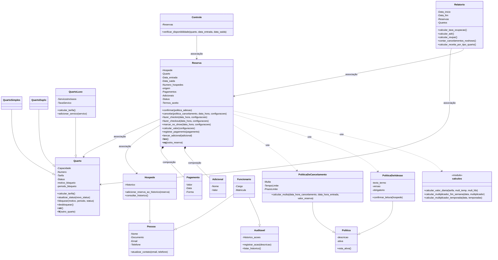

[uml-textual(3).md](https://github.com/user-attachments/files/32778713/uml-textual.3.md)
# Sistema de Reservas de Hotel — UML Textual

## Classes

### Politica
```text
-descricao
-ativa
--------------------
+esta_ativa()
```

### PoliticaDeCancelamento (herda de Politica)
```text
-Multa
-TempoLimite
-PrazoLimite
--------------------
+calcular_multa(data_hora_cancelamento, data_hora_entrada, valor_reserva)
```

### PoliticaDeAdesao (herda de Politica)
```text
-texto_termo
-versao
-obrigatorio
--------------------
+confirmar_leitura(hospede)
```

### Quarto
```text
-Capacidade
-Numero
-Tarifa
-Status
-motivo_bloqueio
-periodo_bloqueio
--------------------
+calcular_tarifa()
+atualizar_status(novo_status)
+bloquear(motivo, periodo, status)
+desbloquear()
+__str__()
+__lt__(outro_quarto)
```

### QuartoSimples (herda de Quarto)
```text
(sem atributos ou métodos próprios — herda tudo de Quarto)
```

### QuartoDuplo (herda de Quarto)
```text
(sem atributos ou métodos próprios — herda tudo de Quarto)
```

### QuartoLuxo (herda de Quarto)
```text
-ServicosInclusos
-TaxaServico
--------------------
+calcular_tarifa()          [sobrescrito]
+adicionar_servico(servico)
```

### Reserva
```text
-Hospede
-Quarto
-Data_entrada
-Data_saida
-Numero_hospedes
-origem
-Pagamentos
-Adicionais
-Status
-Termos_aceito
--------------------
+confirmar(politica_adesao)
+cancelar(politica_cancelamento, data_hora, configuracoes)
+fazer_checkin(data_hora, configuracoes)
+fazer_checkout(data_hora, configuracoes)
+marcar_no_show(data_hora, configuracoes)
+calcular_valor(configuracoes)
+registrar_pagamento(pagamento)
+lancar_adicional(adicional)
+__len__()
+__eq__(outra_reserva)
```

### Relatorio
```text
-Data_inicio
-Data_fim
-Reservas
-Quartos
--------------------
+calcular_taxa_ocupacao()
+calcular_adr()
+calcular_revpar()
+contar_cancelamentos_noshows()
+calcular_receita_por_tipo_quarto()
```

### Pessoa
```text
-Nome
-Documento
-Email
-Telefone
--------------------
+atualizar_contato(email, telefone)
```

### Hospede (herda de Pessoa)
```text
-Historico
--------------------
+adicionar_reserva_ao_historico(reserva)
+consultar_historico()
```

### Auditavel
```text
-Historico_acoes
--------------------
+registrar_acao(descricao)
+listar_historico()
```

### Funcionario (herda de Pessoa e Auditavel — herança múltipla)
```text
-Cargo
-Matricula
--------------------
(métodos herdados de Pessoa e Auditavel)
```

### Pagamento
```text
-Valor
-Data
-Forma
```

### Adicional
```text
-Nome
-Valor
```

### Controle
```text
-Reservas
--------------------
+verificar_disponibilidade(quarto, data_entrada, data_saida)
```

### calculos (`<<module>>`)
```text
+calcular_valor_diaria(tarifa, mult_temp, mult_fds)
+calcular_multiplicador_fim_semana(data, multiplicador)
+calcular_multiplicador_temporada(data, temporadas)
```

---

## Relacionamentos

### Herança
- `Politica_de_cancelamento` --|> `Politica`
- `Politica_de_adesao` --|> `Politica`
- `Quarto_simples` --|> `Quarto`
- `Quarto_duplo` --|> `Quarto`
- `Quarto_Luxo` --|> `Quarto`
- `Hospede` --|> `Pessoa`
- `Funcionario` --|> `Pessoa` **e** `Funcionario` --|> `Auditavel` (herança múltipla)

### Associação
*(seta sai de quem guarda o atributo, aponta para a classe referenciada)*
- `Reserva` → `Quarto`
- `Reserva` → `Hospede`
- `Controle` → `Reserva`
- `Relatorio` → `Quarto`
- `Relatorio` → `Reserva`

### Composição
*(o "filho" nasce dentro do "pai" e não existe fora dele)*
- `Reserva` *-- `Pagamento`
- `Reserva` *-- `Adicional`

### Dependência (usa)
*(recebido como parâmetro, não guardado como atributo)*
- `Reserva` ..> `Politica_de_cancelamento` (via `cancelar`)
- `Reserva` ..> `Politica_de_adesao` (via `confirmar`)
- `Reserva` ..> `calculos` (via `calcular_valor`)

---

## Diagrama (Mermaid)


